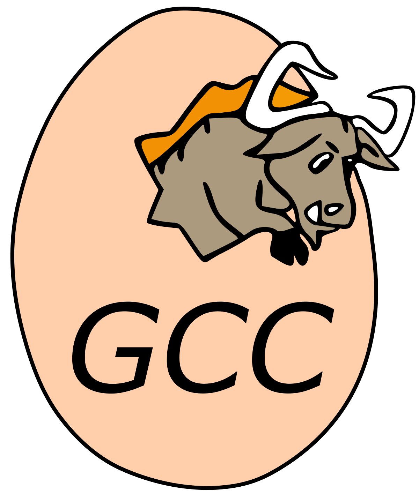

<!-- PROJECT LOGO -->
<br />
<div align="center">
  <a href="" id= "readme-top">
    
  </a>


****

  <p align="center">
    In this repository you'll find all the homework associated with our distributed computing course!
    <br />
  </p>
</div>


<!-- TABLE OF CONTENTS -->
# Table of Contents
- [Table of Contents](#table-of-contents)
- [Introduction](#introduction)
  - [Class Description](#class-description)
  - [Instructor and Teaching Assistant Information](#instructor-and-teaching-assistant-information)
    - [Ruth Selene Fuentes Garcia](#ruth-selene-fuentes-garcia)
    - [Carlos Alberto Arriaga Solorzano](#carlos-alberto-arriaga-solorzano)
- [Getting Started](#getting-started)
    - [Recommended software \& tools](#recommended-software--tools)
    - [Prerequisites](#prerequisites)
    - [Installation](#installation)
- [Course Outline](#course-outline)
  - [Syllabus](#syllabus)
  - [Learning Objectives](#learning-objectives)
- [Homework Assignments](#homework-assignments)
  - [Homework 1](#homework-1)
    - [Running the homework](#running-the-homework)
  - [Homework 2](#homework-2)
  - [Homework 3](#homework-3)
- [Resources](#resources)
  - [Recommended Books](#recommended-books)
  - [Online Materials](#online-materials)
- [The students team](#the-students-team)
    - [Yonathan Berith Jaramillo Ramírez.](#yonathan-berith-jaramillo-ramírez)
    - [Mathematician](#mathematician)


<!-- ABOUT THE PROJECT -->
# Introduction


## Class Description

Distributed Computing is an essential domain of computer science that focuses on the design and implementation of systems that process data across multiple machines or processors. In this course, students will explore the theoretical foundations, algorithms, and systems that form the backbone of distributed computing environments. The course emphasizes both the challenges and benefits of computing in a decentralized manner.

## Instructor and Teaching Assistant Information

### Luis Germán Pérez Hernández

Information of the teacher:
- [UNAM Facultad de Ciencias](http://132.248.181.248/directorio/27591)

- [Mis Profesores](https://www.misprofesores.com/profesores/Luis-German-Perez_98314)


### Daniel Michel Tavera

Information of the Teaching assistant:
- [UNAM](https://archive.fciencias.unam.mx/directorio/90015)

<!-- GETTING STARTED -->
# Getting Started

<div align = "center">
 
</div>


This is an example of how you may give instructions on setting up your project locally.
To get a local copy up and running follow these simple example steps.

### Recommended software & tools

- Terminal: [Oh my zsh!](https://ohmyz.sh/) & [Terminator](https://terminator-gtk3.readthedocs.io/en/latest/)
- Code editor: [Visual Studio Code](https://code.visualstudio.com/)
- Operating System: [Ubuntu 23.04](https://ubuntu.com/download/desktop)


### Prerequisites

This is an example of how to list things you need to use the software and how to install them.

<!-- Center-aligned table containing logos and installation links -->
<div align="center">

  <!-- Logos -->
  

  <!-- Installation Links -->
  
  | [GCC Installation](https://phoenixnap.com/kb/install-gcc-ubuntu) |

</div>


### Installation

1. Clone the repo:
   
    With https:
   ```sh
   git clone https://github.com/Yony6041/distributed-computing.git
   ```
    With ssh:

   ```sh
   git clone git@github.com:Yony6041/distributed-computing.git
   ```


<p align="right">(<a href="#readme-top">back to top</a>)</p>


# Course Outline
<div align = "center">
 
</div>

<p align="right">(<a href="#readme-top">back to top</a>)</p>

## Syllabus

<p align="right">(<a href="#readme-top">back to top</a>)</p>

## Learning Objectives

<p align="right">(<a href="#readme-top">back to top</a>)</p>
# Homework Assignments
<div align = "center">
 
</div>

## Homework 1
<p align="right">(<a href="#readme-top">back to top</a>)</p>

### Running the homework

1. gcc -o runPractice1 Practica1_YonathanBerith_JaramilloRamírez.c
2. ./runPractice1

<p align="right">(<a href="#readme-top">back to top</a>)</p>

## Homework 2
<p align="right">(<a href="#readme-top">back to top</a>)</p>
## Homework 3

<p align="right">(<a href="#readme-top">back to top</a>)</p>

# Resources

<p align="right">(<a href="#readme-top">back to top</a>)</p>

## Recommended Books

<p align="right">(<a href="#readme-top">back to top</a>)</p>

## Online Materials


<p align="right">(<a href="#readme-top">back to top</a>)</p>


# The students team 


### Yonathan Berith Jaramillo Ramírez.
Computer scientist
- [Github](https://github.com/Yony6041)
- [LinkedIn](https://www.linkedin.com/in/yonathan-jaramillo-a506181a7/?originalSubdomain=mx)


<p align="right">(<a href="#readme-top">back to top</a>)</p>
